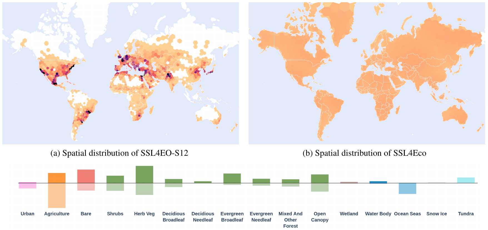

<div align="center">

# SSL4Eco<br>🌍🌱

Official implementation for
<br>
**[_SSL4Eco: A Global Seasonal Dataset for Geospatial Foundation Models in Ecology_](https://arxiv.org/abs/2504.18256)**
<br>
CVPR EarthVision workshop 2025
<br>
[](https://arxiv.org/abs/2504.18256)
[](https://plekhanovaelena.github.io/ssl4eco)
<br>
<br>
**If you ❤️ or simply use this project, don't forget to give the repository a ⭐,
it means a lot to us !**
<br>
</div>

```
@article{plekhanova2025ssl4eco,
  title={SSL4Eco: A Global Seasonal Dataset for Geospatial Foundation Models in Ecology},
  author={Plekhanova, Elena and Robert, Damien and Dollinger, Johannes and Arens, Emilia and Brun, Philipp and Wegner, Jan Dirk and Zimmermann, Niklaus},
  journal={Proceedings of the IEEE/CVF Conference on Computer Vision and Pattern Recognition Workshops},
  year={2025},
}
```

## 📌  Description

<p align="center">
  
</p>

**SSL4Eco** is a Sentinel-2 dataset for pretraining geospatial 
foundation models. More specifically, this project proposes a recipe for 
building pretraining sets that capture the geographical and phenological 
diversity of ecosystems across the globe. We observe that this simple 
spatiotemporal sampling yields significant improvements on various 
downstream macroecological tasks. 

<br>

## 📰  Updates
- **24.04.2025** 🚧 Datasets, code, and weights will soon be publicly 
released !
- **11.06.2025** 🌱 First code release

<br>

## 💻  Environment requirements
This project was tested with:
- Linux OS
- NVIDIA A100

The code _may_ work in other environments but has not been thoroughly 
tested yet.

<br>

## 🏗  Installation
Simply run:

```bash
pip install -r requirements.txt
```

<br>

## 🔩  Project structure
```
└── ssl4eco
    ├── data_download             # For downloading SSL4Eco or downstream datasets 
    ├── docs                      # Project webpage
    ├── downstream_tasks          # For evaluating models on downstream tasks
    ├── index_files               # Metadata for SSL4Eco and our newly downstream datasets
    ├── pretraining               # For pretraining SeCo-Eco or MoCo-Eco on SSL4Eco
    ├── .gitignore                # List of files ignored by git
    ├── LICENSE                   # Project license
    ├── README.md                 # Readme
    └── requirements.txt          # Dependencies for pip install
```

<br>

## 🚀  Usage
### Downloading datasets
See the [data download section](data_download/README.md) for further
details on downloads. 

### Downloading pretrained weights
The weights for our SeCo-Eco model pretrained on the SSL4Eco dataset are
available on [huggingface](https://huggingface.co/eplekh/secoeco) 🤗.

### Evaluation on downstream tasks
See the [downstream tasks section](downstream_tasks/README.md) for 
further details on evaluating foundation models on macroecological 
downstream tasks. 

### Pretraining
See the [pretraining section](pretraining/README.md) for pretraining our
SeCo-Eco or MoCo-Eco models on SSL4Eco.

<br>

## Citing our work
If your work uses a part of the present code or ideas, please include 
the following citation:

```
@article{plekhanova2025ssl4eco,
  title={SSL4Eco: A Global Seasonal Dataset for Geospatial Foundation Models in Ecology},
  author={Plekhanova, Elena and Robert, Damien and Dollinger, Johannes and Arens, Emilia and Brun, Philipp and Wegner, Jan Dirk and Zimmermann, Niklaus},
  journal={Proceedings of the IEEE/CVF Conference on Computer Vision and Pattern Recognition Workshops},
  year={2025},
}
```

You can find our [paper 📄](https://arxiv.org/abs/2504.18256) on arxiv.

Also, **if you ❤️ or simply use this project, don't forget to give the 
repository a ⭐, it means a lot to us !**
